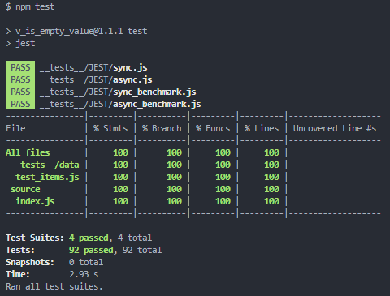

# 👨‍💻 v_is_empty_value

Simple checker for Empty/NotEmpty values. Checking Numbers, Null, NaN, Strings, Objects, Arrays...Will also detect instance of Date() object and return "not-empty" value for it.

### 🔩 Install using command

    npm install v_is_empty_value

### 🎭 And save for later re-install

    npm install v_is_empty_value --save

### 🪁 How to use

    const { isEmpty, notEmpty } = require("v_is_empty_value");

### ☑ Things it confirms Empty

    await isEmpty()  //-> TRUE
    await notEmpty()  //-> FALSE

    await isEmpty("")  //-> TRUE
    await notEmpty("")  //-> FALSE

    await isEmpty(null)  //-> TRUE
    await notEmpty(null)  //-> FALSE

    await isEmpty(undefined)  //-> TRUE
    await notEmpty(undefined)  //-> FALSE

    await isEmpty(NaN)  //-> TRUE
    await notEmpty(NaN)  //-> FALSE

    await isEmpty({})  //-> TRUE
    await notEmpty({})  //-> FALSE

    await isEmpty([])  //-> TRUE
    await notEmpty([])  //-> FALSE

### ☑ Few things it confirms NOT Empty

    await isEmpty("demo_password_123456")  //-> FALSE
    await notEmpty("demo_password_123456")  //-> TRUE

    await isEmpty(new Date())  //-> FALSE
    await notEmpty(new Date())  //-> TRUE

    await isEmpty(new Error())  //-> FALSE
    await notEmpty(new Error())  //-> TRUE

    await isEmpty(new Promise((resolve, reject) => resolve(true)))  //-> FALSE
    await notEmpty(new Promise((resolve, reject) => resolve(true)))  //-> TRUE

## 🚀 Benchmarking

Currently does more than ~1100 verifications per millisecond. Both functions use the almost same amount of time so they average about the same (+-5%).

## ✅ Test Results and Coverage with Jest

📑 Related links :

* [v_to_md5](https://www.npmjs.com/package/v_to_md5) ⏭ MD5 hash generator
* [v_to_sha256](https://www.npmjs.com/package/v_to_sha256) ⏭ sha256 hash generator
* [v_file_system](https://www.npmjs.com/package/v_file_system) ⏭ simple and safe fs module with sync and promises
* [v_execute](https://www.npmjs.com/package/v_execute) ⏭ Exec cli commands
* [v_scrolls](https://www.npmjs.com/package/v_scrolls) ⏭ Readme Generator
* [v_database](https://www.npmjs.com/package/v_database) ⏭ single database solution
* [v_database_cli](https://www.npmjs.com/package/v_database_cli) ⏭ v_database cli tool
